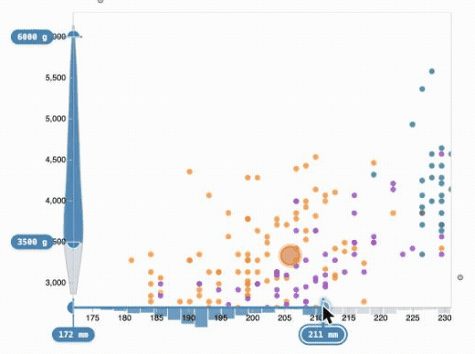

# d3-zoomable-axis

**A d3 axis you can drag to zoom.** It combines a [d3 axis](https://d3js.org/d3-axis)
(ticks, labels, domain line) with a dual-handle range control: drag the handles to select a
`[lo, hi]` sub-range, which it emits in **data space**. One scale, one element — the axis *is*
the zoom control, so it lines up with your chart by construction (no pixel-offset hacks).

[](https://john-guerra.github.io/d3ZoomableAxis/)

**▶ [Live interactive demo](https://john-guerra.github.io/d3ZoomableAxis/)** — drag the axis
handles to zoom a penguins scatterplot in your browser.

> npm: `@john-guerra/d3-zoomable-axis` · status: **early (0.0.x)**

## Two entry points

The package ships two independent layers — import only what you need:

| Import | What you get |
| --- | --- |
| `@john-guerra/d3-zoomable-axis` | **Core** d3 component — `zoomableAxis{Bottom,Top,Left,Right}`, a [d3-idiom](./docs/d3-api-style.md) factory applied via `selection.call(...)`, built on `d3-brush`. Chainable accessors, `d3-dispatch` events. Dependency-light. |
| `@john-guerra/d3-zoomable-axis/input` | **Accessible reactive widget** — `zoomableAxisInput`, a DOM element with `.value` `[lo, hi]` that dispatches `input` ([reactivewidgets.org](https://reactivewidgets.org) / Observable `view()`). Native `<input type=range>` handles, a scented distribution overlay, drag-to-pan, editable value badges, and a live settings panel. |

Splitting the entries keeps the core free of the widget's optional peer
(`reactive-widget-helper`) and density deps (`fast-kde`, `d3-shape`) — those are only pulled
in when you import `/input`.

**Accessibility** is a property of the **widget** layer: its handles are real
`<input type="range">` elements — keyboard-operable (arrows / Page / Home / End),
screen-reader announced (named sliders with `aria-valuetext`), and standard HTML form inputs.
The core `zoomableAxis*` factories are `d3-brush`-based (pointer/touch; not keyboard-accessible).

## Install

```bash
npm install @john-guerra/d3-zoomable-axis
# for the widget layer, also install its optional peer:
npm install reactive-widget-helper
```

When bundling, the `d3-*` submodules (and, for the widget, `fast-kde`) come along as regular
dependencies — nothing extra to do.

### From a CDN (script tag) — core only

The UMD bundle is the **core** layer and is **peer-global**: to keep it small it does *not*
embed d3, so load d3 first. The factories merge into the shared global `d3`:

```html
<script src="https://cdn.jsdelivr.net/npm/d3@7"></script>
<script src="https://cdn.jsdelivr.net/npm/@john-guerra/d3-zoomable-axis"></script>
<script>
  // factories are merged into the shared global `d3`
  const slider = d3.zoomableAxisBottom(d3.scaleLinear().domain([24, 92]).range([0, 600]));
</script>
```

The widget layer is ESM-only; import it from a bundler, or over ESM from
`https://cdn.jsdelivr.net/npm/@john-guerra/d3-zoomable-axis/src/input.js`.

## Core component (d3 idiom)

```js
import * as d3 from "d3";
import { zoomableAxisBottom } from "@john-guerra/d3-zoomable-axis";

const x = d3.scaleLinear().domain([24, 92]).range([0, 600]);

const slider = zoomableAxisBottom(x)
  .step(1)
  .ticks(10)
  .value([30, 60])                  // initial [lo, hi] in data space
  .on("input", (v) => chart.zoomX(v))  // fires while dragging
  .on("end",   (v) => persist(v));

d3.select("svg").append("g")
  .attr("transform", "translate(20,40)")
  .call(slider);

slider.value();          // -> [30, 60]
slider.value([40, 70]);  // set + re-render, no event
```

Factories: `zoomableAxisBottom`, `zoomableAxisTop`, `zoomableAxisLeft`, `zoomableAxisRight`
(orientation mirrors d3-axis). Accessors: `scale`, `value`, `step`, `handleSize`, `ticks`,
`tickArguments`, `tickValues`, `tickFormat`, `tickSize`, `tickSizeInner`, `tickSizeOuter`,
`tickPadding`, `on`. Events (`d3-dispatch`): `start`, `input`, `end` — each receives `[lo, hi]`
in data space (inverted from pixels, snapped to `step`). Imperative `slider.move(g, [lo,hi])`
sets and emits; `slider.value([lo,hi])` sets silently.

## Reactive widget (Observable / reactivewidgets.org)

```js
import { zoomableAxisInput } from "@john-guerra/d3-zoomable-axis/input";

const weeks = view(zoomableAxisInput([24, 92], {
  orient: "bottom", step: 1, length: 600, value: [30, 60],
  label: "Weeks", units: "wk",
}));
// `weeks` is reactive [lo, hi]; the element has .value and dispatches "input".
```

Drag a handle to resize an end, drag the band between the handles to **pan** the window, or
**double-click a value badge** to type an exact value (an OS-native `number` / `date` /
`datetime-local` / `time` picker, via the `inputType` option). Every handle is a
keyboard-focusable native slider.

Key options: `orient`, `step`, `length`, `value`, `label`, `units`, `format`, `inputType`
(`"number"` | `"date"` | `"time"` | `"datetime-local"`), `ticks`, `thickness`, `margin`, and
`scent` (below). Events: `input` (DOM, on the element) plus `start` / `input` / `end` / `scent`
via `el.on(...)`.

### Scented distribution

Pass `scent` to draw the data distribution along the axis (a
[scented widget](https://idl.cs.washington.edu/papers/scented-widgets/) — see where the data is
dense before you zoom). A ⚙ settings panel lets you retune it live.

```js
zoomableAxisInput([170, 235], {
  orient: "bottom", length: 600, value: [190, 215],
  scent: {
    values: flipperLengths,   // number[]
    type: "histogram",        // "histogram" | "violin" | "area"
    bins: 28,
    direction: "out",         // "out" = away from the plot, "in" = toward it
  },
});
```

`scent` options: `type`, `bins`, `size`, `direction` (`"out"` | `"in"`; histogram + area only —
`side` is an alias), `style` (`"kde"` | `"bars"`), `color`, `colorSelected`, KDE tunables
(`bandwidth`, `adjust`, `pad`), `curve` (a d3-shape curve factory or name string), `controls`
(the ⚙ panel — on by default; `false` to hide), and `persistKey` (remember tuned params in
`localStorage`). Panel edits also fire a `scent` event (`el.on("scent", params => …)`).

See it live: **[john-guerra.github.io/d3ZoomableAxis](https://john-guerra.github.io/d3ZoomableAxis/)**
(a landing page + demo that import the published npm package from a CDN). The source is in
[`examples/demo.html`](./examples/demo.html) — live zoom, dynamic-query filtering, and a
brush-synced example (and [`examples/test-local.html`](./examples/test-local.html) for an
offline smoke test).

## Design & background

- [docs/DESIGN.md](./docs/DESIGN.md) — architecture, API, packaging.
- [docs/d3-api-style.md](./docs/d3-api-style.md) — the d3 reusable-component idiom reference.
- [docs/history-direct-manipulation-rangesliders.md](./docs/history-direct-manipulation-rangesliders.md)
  — Shneiderman & Plaisant dynamic-query range sliders and design takeaways.

## License

MIT © [John Alexis Guerra Gómez](https://johnguerra.co)
